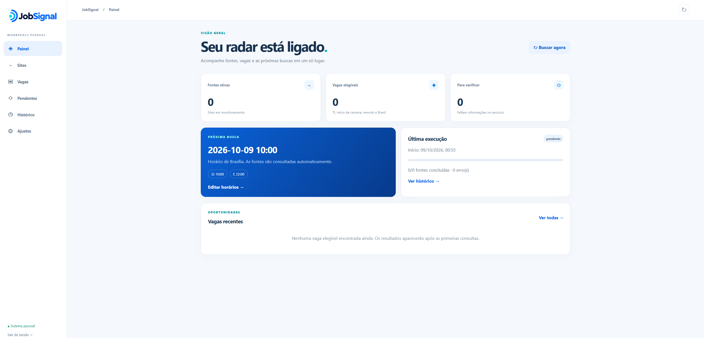

# JobSignal

Aplicação pessoal para acompanhar vagas de tecnologia em estágio, trainee, júnior e analista júnior. O JobSignal consulta fontes de emprego cadastradas, classifica anúncios com critérios conservadores e reúne os resultados em um painel. A candidatura é feita no anúncio original.

## 🖥️ Prévia da interface



## ✨ Funcionalidades

- 🔎 **Coleta:** buscas manuais e automáticas em fontes compatíveis, com histórico de execução e falhas por fonte.
- 🎯 **Classificação:** uma vaga só é elegível quando o anúncio traz evidências de atuação em TI, modalidade remota e disponibilidade para residentes no Brasil. Casos sem confirmação ficam pendentes de verificação.
- 🗂️ **Acompanhamento:** em vagas elegíveis, selecione um estado e confirme em **OK**. **Nova** e **Tenho interesse** continuam no painel. **Me candidatei** e **Descartada por mim** vão para o **Histórico de vagas**, com opção de restauração.
- ✉️ **Notificações:** ao concluir uma busca, o sistema pode enviar um único resumo com os links de todas as vagas elegíveis ainda não notificadas. Vagas já enviadas não entram novamente no resumo.
- 🔐 **Acesso:** API protegida por chave pessoal, sem cadastro público de usuários.

## 🧱 Arquitetura

| Camada | Tecnologia | Responsabilidade |
| --- | --- | --- |
| Interface | Angular | Painel, filtros, histórico e ajustes |
| Aplicação | Cloudflare Workers | API, coleta, classificação e envio de notificações |
| Persistência | Cloudflare D1 | Configurações, fontes, vagas, execuções e histórico |
| Processamento | Cloudflare Queues e Cron Triggers | Buscas em segundo plano e agendamento |
| Arquivos estáticos | Cloudflare Workers Assets | Interface compilada |

`src/` contém a interface; `worker/` contém a API e os adaptadores de coleta; `migrations/` guarda a evolução versionada do D1; `public/` contém os arquivos estáticos. As regras e limitações das integrações estão em [Fontes e classificação](docs/fontes-e-classificacao.md).

## 🛠️ Desenvolvimento local

**Pré-requisitos:** Node.js e npm compatíveis com as versões declaradas em `package.json`. Para usar recursos remotos, autentique o Wrangler na conta Cloudflare que contém o projeto.

1. Instale as dependências:

   ```powershell
   npm ci
   ```

2. Copie `.dev.vars.example` para `.dev.vars` e configure `ACESSO_TOKEN` com uma chave aleatória de pelo menos 24 caracteres. `.dev.vars` é local e não deve ser versionado.

3. Aplique as migrações locais, compile a interface e inicie o Worker:

   ```powershell
   npm run db:local
   npm run build
   npm run dev:worker
   ```

Abra o endereço informado pelo Wrangler e insira a chave configurada. O Worker local serve a interface compilada e a API na mesma origem. Depois de alterar a interface, execute `npm run build` novamente; `npm run start` inicia apenas o servidor de desenvolvimento do Angular.

## 🔗 Fontes e critérios

Cadastre a página de listagem de vagas de uma fonte compatível. O projeto possui adaptadores para Greenhouse, Lever, Recrut.ai, CI&T, CWI, Remotar, Gupy, InfoJobs, Catho, APInfo, Nerdin, GeekHunter, Vagas.com e o portal de carreiras da NTT DATA.

Os adaptadores dependem dos formatos públicos disponibilizados por cada site. Mudanças nesses formatos ou bloqueios de acesso podem interromper a coleta; as falhas aparecem no histórico de buscas. Links sem integração reconhecida não são consultados automaticamente.

## ✉️ Notificações por e-mail

Em **Ajustes**, configure remetente, destinatário e a opção de receber notificações. Para envio pelo Gmail, a conta remetente precisa ter verificação em duas etapas e uma senha de app. Salve essa senha no campo próprio da interface; não use a senha normal da conta. A senha de app é criptografada no D1 com uma chave mantida como segredo do Worker.

O segredo `EMAIL_ENCRYPTION_KEY` deve conter **32 bytes codificados em Base64**. Em uma instalação nova, configure esse segredo antes de salvar a senha de app. Não altere uma chave já usada sem migrar a credencial criptografada.

Ao término de cada busca, o JobSignal reúne as vagas elegíveis que ainda não foram notificadas em **uma mensagem com seus links**. Buscas manuais seguem a mesma regra. Vagas arquivadas ou já enviadas ficam fora do próximo resumo. Se a confirmação de entrega for incerta, a tentativa fica registrada para conferência antes de qualquer reenvio.

O envio por OAuth 2.0 também é suportado quando os segredos `GMAIL_CLIENT_ID`, `GMAIL_CLIENT_SECRET` e `GMAIL_REFRESH_TOKEN` estão configurados. O botão **Enviar e-mail de teste** em Ajustes serve para verificar as credenciais e a entrega.

## ☁️ Publicação

O `wrangler.jsonc` define Worker, banco D1, fila, recursos de limitação de taxa, arquivos estáticos e gatilho de agendamento. Em uma conta nova, provisionar o banco e a fila exige atualizar o identificador do D1 nesse arquivo. Na conta já configurada, aplique apenas as novas migrações antes de publicar:

```powershell
npm run db:remoto
npm run publicar
```

`npm run publicar` compila o Angular e publica o Worker com seus arquivos estáticos. Cadastre `ACESSO_TOKEN` e `EMAIL_ENCRYPTION_KEY` como segredos do Worker com `npx wrangler secret put NOME_DO_SEGREDO`; nunca inclua valores reais no repositório.

## ✅ Verificação

```powershell
npm test
npm run verificar:worker
npm run build
```

Os comandos executam os testes das regras e dos adaptadores, verificam os tipos do Worker e compilam a interface. Antes de considerar uma integração recuperada após uma mudança no portal de origem, confira uma busca real e os links gerados.

## 🔒 Segurança e limites

A API exige a chave de acesso em suas rotas e usa limites de requisições configurados no Worker. A chave informada na interface fica em `sessionStorage`; segredos de envio permanecem fora do código e da interface compilada. Para expor o painel a mais usuários, revise a autenticação e considere uma camada adicional de controle de acesso.

A classificação depende das informações publicadas pelas fontes e pode deixar anúncios inconclusivos na lista de pendências. O JobSignal não realiza candidaturas nem garante a disponibilidade contínua de portais de terceiros.
